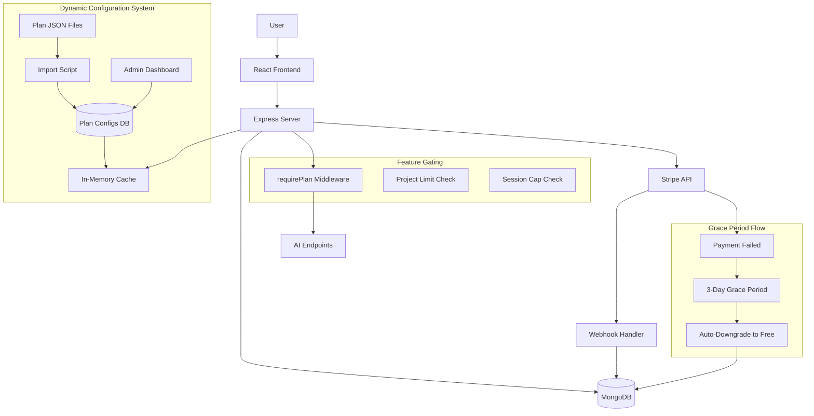
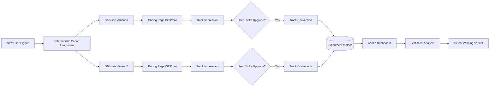
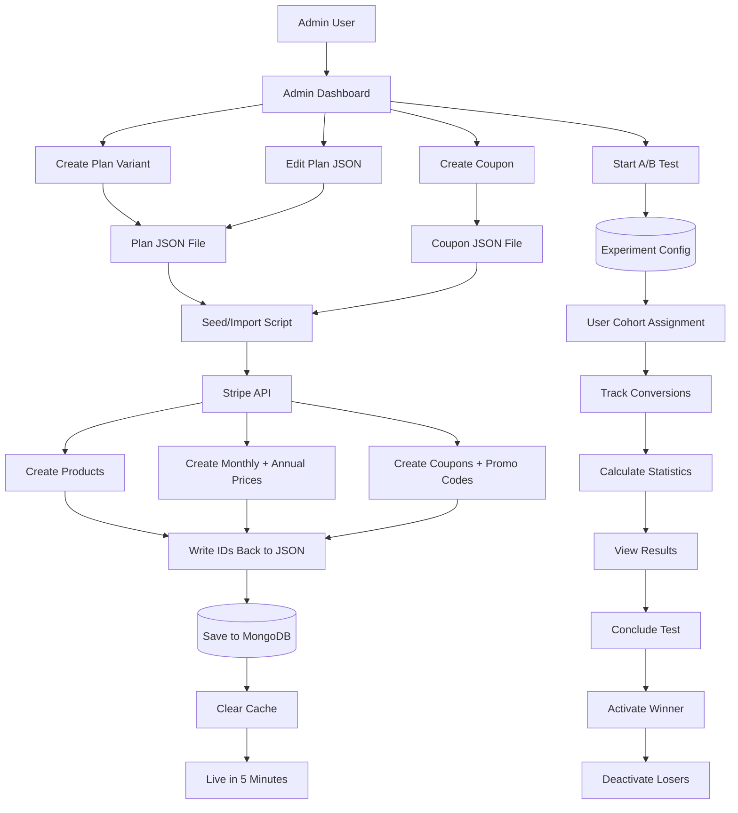
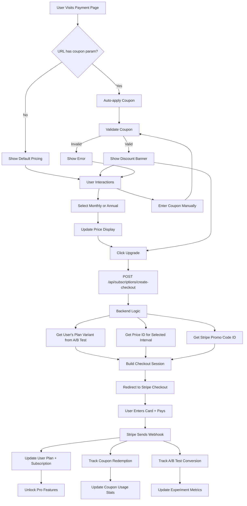

# Stripe Subscription Integration Plan

## Architecture Overview

This plan adds subscription management to support Free and Pro tiers with configurable infrastructure for future tier expansion. Billing is **provider-agnostic**: the app depends on a single billing interface; the active provider (Stripe at launch, Recurly or others later) is selected via `PAYMENT_PROVIDER` and implements that contract. Controllers, jobs, and business logic never import Stripe or any provider SDK directly.

### Tier Comparison

**Free Tier (Default):**

- 30 days data retention
- 1,000 sessions/month cap
- Session recordings only (no AI features)
- Single project limit
- No dev tools access

**Pro Tier:**

**Monthly:** $29/month
**Annual:** $290/year ($24.17/mo - save 2 months)

Features:

- 90 days data retention
- 5,000 sessions/month cap
- Full AI tools suite (root cause analysis, session summaries, insights, reports, A/B tests, clustering)
- Multiple projects (unlimited)
- Dev tools in replay

### User Journey

1. User signs up → Starts on Free (no card required)
2. User hits limits or wants AI features → Upgrades to Pro via payment page
3. Subscription managed via billing provider (Stripe at launch) → Real-time webhook updates
4. Subscription expires → 3-day grace period → Auto-downgrade to Free

---

## Payment Provider Abstraction

Billing is implemented behind a **provider interface** so the codebase does not depend on Stripe (or any single vendor). The active provider is chosen by `PAYMENT_PROVIDER` (default `stripe`); only the adapter for that provider is loaded. To switch to Recurly later, implement the same interface and point config at it.

**Principles:**

- Controllers, jobs, and config API call **billingService** only (no Stripe imports).
- User model stores **normalized** billing fields (`billing.`*), not provider-specific names.
- Webhooks are parsed and normalized by the adapter; a single **subscriptionEventHandler** applies business logic (plan, retention, grace period).
- Plan/coupon JSON holds **provider-specific ID blocks** (e.g. `stripe`, later `recurly`); seed script and adapter use only the block for the current provider.

**Adding another provider (e.g. Recurly):** Implement `adapters/recurlyAdapter.js` against the same interface, add route `POST /api/webhooks/billing/recurly`, extend seed to write Recurly IDs, set `PAYMENT_PROVIDER=recurly`. No changes to subscription controller, plan enforcement, or frontend.

---

## Backend Implementation

### 1. Database Schema Updates

**Update User Model** ([quicklook-server/src/models/User.js](quicklook-server/src/models/User.js)):

Use **provider-agnostic** billing fields so business logic never depends on Stripe (or Recurly) field names:

```javascript
// Normalized billing fields (no provider-specific names)
billing: {
  provider: String,              // 'stripe' | 'recurly'
  customerId: String,
  subscriptionId: String,
  status: String,                // normalized: active, past_due, canceled, trialing, incomplete
  priceId: String,
  interval: String,              // 'monthly' | 'annual'
  currentPeriodEnd: Date,
  cancelAtPeriodEnd: Boolean
},
billingProviderPayload: Mixed,   // Optional: provider-specific blob for edge cases
couponsUsed: [{
  couponId: String,
  code: String,
  usedAt: Date,
  subscriptionId: String
}],
gracePeriodEnd: Date,
previousPlan: String
```

**Track billing interval and coupon usage for analytics and restrictions.**

Update `sessionCap` based on plan:

- Free: 1000
- Pro: 5000

Update `retentionDays` in projects based on plan:

- Free: 30
- Pro: 90

### 2. Billing Provider Interface and Adapters

**Create** [quicklook-server/src/billing/providerInterface.js](quicklook-server/src/billing/providerInterface.js): Document the contract (JSDoc or stub) that any billing provider must implement. No Stripe/Recurly types in this file. All amounts in **cents**; status values normalized (e.g. `active`, `past_due`, `canceled`, `trialing`, `incomplete`).

**Required methods:**


| Method                                                              | Purpose                     | Out (normalized)                                                     |
| ------------------------------------------------------------------- | --------------------------- | -------------------------------------------------------------------- |
| `createCustomer(email, name)`                                       | Create billing customer     | `{ customerId }`                                                     |
| `createCheckoutSession(params)`                                     | Start hosted checkout       | `{ redirectUrl, sessionId }`                                         |
| `createBillingPortalSession(customerId, returnUrl)`                 | Manage subscription         | `{ redirectUrl }`                                                    |
| `getSubscription(subscriptionId)`                                   | Fetch subscription          | `{ status, priceId, interval, currentPeriodEnd, cancelAtPeriodEnd }` |
| `cancelSubscription(subscriptionId)`                                | Cancel at period end        | `{ canceled, currentPeriodEnd }`                                     |
| `getInvoices(customerId, limit)`                                    | List invoices               | `[{ id, amount, status, createdAt, invoicePdfUrl }]`                 |
| `getUpcomingInvoice(customerId)`                                    | Preview next charge         | `{ amount, nextPaymentAt }` or null                                  |
| `getClientConfig()`                                                 | Frontend config             | `{ publishableKey?, provider }`                                      |
| `handleWebhook(rawBody, signature, headers)`                        | Parse and normalize webhook | `{ events: [{ type, subscriptionId?, customerId?, status?, ... }] }` |
| `createProduct(name, description, metadata)`                        | Create product/plan (seed)  | `{ productId }`                                                      |
| `createPrice(productId, amountCents, currency, interval, metadata)` | Create price (seed)         | `{ priceId }`                                                        |
| `createCoupon(spec)`                                                | Create discount (seed)      | `{ couponId, promoCodeId }`                                          |
| `validatePromoCode(code)`                                           | Validate coupon             | `{ valid, discount?, error? }`                                       |


**Create** [quicklook-server/src/billing/billingService.js](quicklook-server/src/billing/billingService.js): Single entry point. Reads `PAYMENT_PROVIDER` (default `stripe`), loads the corresponding adapter, and delegates all calls. Controllers and jobs use only `billingService`, never a provider SDK.

**Create** [quicklook-server/src/billing/adapters/stripeAdapter.js](quicklook-server/src/billing/adapters/stripeAdapter.js): Implements the full interface using the Stripe SDK. All Stripe-specific code and env vars (`STRIPE_SECRET_KEY`, `STRIPE_WEBHOOK_SECRET`) live here. Maps Stripe webhook events to normalized event types.

**Create** [quicklook-server/src/billing/subscriptionEventHandler.js](quicklook-server/src/billing/subscriptionEventHandler.js): Accepts normalized events from any adapter and updates User (`billing`, `plan`), project retention, session caps, grace period, and downgrades. No Stripe or Recurly logic.

**Plan/coupon config:** Store external IDs per provider (e.g. plan has `stripe: { productId, monthlyPriceId, annualPriceId }`; later `recurly: { ... }`). Seed script and adapter use only the block for the current provider.

### 3. Subscription Controller

**Create** `quicklook-server/src/controllers/subscriptionController.js`:

Uses **billingService** only (no Stripe or provider imports). Request/response shapes are provider-agnostic.

**Endpoints:**

- `POST /api/subscriptions/create-checkout` - Create checkout session
  - Request: `{ tier: "pro", interval: "annual", couponCode: "LAUNCH50" }`
  - Looks up user's assigned plan variant, gets priceId for interval, validates coupon
  - Calls `billingService.createCheckoutSession(...)`; returns `{ redirectUrl }`
- `POST /api/subscriptions/validate-coupon` - Validate coupon (via billingService or couponService using adapter's `validatePromoCode`)
- `GET /api/subscriptions/status` - Get current subscription (billingService.getSubscription)
- `POST /api/subscriptions/create-portal` - Billing portal (billingService.createBillingPortalSession)
- `GET /api/subscriptions/invoices` - List invoices (billingService.getInvoices)
- `POST /api/subscriptions/cancel` - Cancel at period end (billingService.cancelSubscription)

**Config endpoints:**

- `GET /api/config/plans` - Get active plans for user (includes A/B test variant, both monthly + annual pricing)
- `GET /api/config/billing` - Provider-agnostic: `{ publishableKey?, provider: 'stripe', checkoutMethod: 'redirect' }` (implemented via billingService.getClientConfig())
- `GET /api/config/coupons/validate?code=XXX` - Public coupon validation

All subscription endpoints protected with `requireAuth` middleware. Config endpoints are public.

### 4. Webhook Handler

**Create** `quicklook-server/src/controllers/webhookController.js` (or billing webhook controller):

**Provider-specific routes** so each provider's webhook URL and signature verification stay in the adapter:

- `POST /api/webhooks/billing/stripe` - Raw body passed to Stripe adapter's `handleWebhook(rawBody, signature, headers)`; adapter returns normalized events.
- Later: `POST /api/webhooks/billing/recurly` - Same pattern for Recurly.

**Shared flow:** After the adapter returns normalized events, call **subscriptionEventHandler** (single place) to update User (`billing`, `plan`), project retention, session caps, grace period, and downgrades. No provider logic in the handler.

**Normalized event types (examples):** `subscription.created`, `subscription.updated`, `subscription.canceled`, `invoice.paid`, `invoice.failed`, `checkout.completed`. Adapter maps provider events (e.g. `customer.subscription.deleted`) to these.

**Adding Recurly (or another provider) later:** Implement `billing/adapters/recurlyAdapter.js` against the same provider interface. Add route `POST /api/webhooks/billing/recurly` and wire it to the adapter plus the same `subscriptionEventHandler`. Extend `seedBilling.js` (or add a Recurly seed) to run when `PAYMENT_PROVIDER=recurly` and write Recurly IDs into plan/coupon config (e.g. under `recurly` key). Set `PAYMENT_PROVIDER=recurly` and configure the provider's webhook URL. No changes to subscription controller, plan enforcement, grace period job, or frontend; only config endpoint response may differ (e.g. no `publishableKey` for Recurly).

### 5. Plan Enforcement Middleware

**Create** `quicklook-server/src/middleware/requirePlan.js`:

```javascript
// Example: requirePlan(['pro', 'premium'])
function requirePlan(allowedPlans) {
  return (req, res, next) => {
    if (!allowedPlans.includes(req.user.plan)) {
      return res.status(403).json({ 
        error: 'Upgrade required',
        requiredPlan: 'pro'
      });
    }
    next();
  };
}
```

Apply to AI endpoints:

- `/api/quicklook/insights/*` - Require Pro
- `/api/quicklook/reports/*` - Require Pro
- `/api/quicklook/ab-tests/*` - Require Pro
- Session summary/root cause endpoints - Require Pro

### 6. Project Creation Limits

**Update** [quicklook-server/src/controllers/quicklookController.js](quicklook-server/src/controllers/quicklookController.js):

In `createProject()`:

- Check user's plan
- Free users: Limit to 1 project (return 403 if limit reached)
- Pro users: Unlimited projects

### 7. Grace Period Cleanup Job

**Create** `quicklook-server/src/jobs/gracePeriodCleanup.js`:

**Schedule:** Runs every hour
**Logic:**

- Find users where `gracePeriodEnd < now` AND `plan !== 'free'`
- Downgrade to Free
- Update all projects' `retentionDays` to 30
- Update `sessionCap` to 1000
- Send email notification (optional)

### 8. Session Cap Enforcement for AI Processing

**CRITICAL:** When users reach their session cap, the system must STOP all AI processing for their sessions.

**Update** `quicklook-server/src/services/QuicklookService.js`:

Add helper method:

```javascript
async hasReachedSessionCap(userId) {
  const user = await User.findById(userId);
  if (!user.sessionCap) return false;
  
  const thirtyDaysAgo = new Date(Date.now() - 30 * 24 * 60 * 60 * 1000);
  const projects = await QuicklookProject.find({ owner: userId });
  const projectKeys = projects.map(p => p.projectKey);
  
  const count = await QuicklookSession.countDocuments({
    projectKey: { $in: projectKeys },
    status: 'closed',
    createdAt: { $gte: thirtyDaysAgo }
  });
  
  return count >= user.sessionCap;
}
```

**Integration Points:**

1. **Session Start** (already exists): Block new session creation when cap reached
2. **AI Processing Proxy** (NEW): Add cap check before forwarding to analytics service
  - Before proxying to `/process`, `/insights/generate`, etc.
  - Check if project owner has reached cap
  - Return 402 Payment Required if capped
  - Skip AI processing entirely

**Update** analytics proxy endpoints in `quicklookController.js`:

- Before calling analytics service, verify user hasn't exceeded their session cap
- If capped and user is Free, return error: "Session limit reached. Upgrade to Pro for 5,000 sessions/month"
- If capped and user is Pro (edge case), return error: "Session limit reached for current billing period"

**Analytics Service Note:**

The Python analytics service (`quicklook-analytics`) should also respect session caps when batch processing:

- Add optional `userId` or `projectKey` filter to `/process` endpoint
- Skip processing for users who are over their cap
- Add cap checking logic in batch processor

### 8. Environment Variables

**Add to** `quicklook-server/.env`:

```bash
# Stripe credentials (only secrets in env vars)
STRIPE_SECRET_KEY=rk_test_xxx
STRIPE_WEBHOOK_SECRET=whsec_xxx  # Get from Stripe dashboard
STRIPE_PUBLISHABLE_KEY=pk_test_xxx  # For frontend access via API

# App configuration
APP_URL=http://localhost:5173     # Frontend URL for redirects

# Note: Price IDs are stored in plan JSON files, NOT here
# This allows changing prices without environment variable updates
```

---

## Frontend Implementation

### 1. Stripe SDK Integration

**Install dependencies:**

```bash
npm install @stripe/stripe-js @stripe/react-stripe-js
```

**Create** `quicklook-app/src/utils/stripe.js`:

- Fetch client config from `GET /api/config/billing` (returns `publishableKey`, `provider`; backend is provider-agnostic)
- Initialize Stripe dynamically
- Export `getStripe()` async function
- No hardcoded keys in frontend

### 2. Subscription API Client

**Update** [quicklook-app/src/api/quicklookApi.js](quicklook-app/src/api/quicklookApi.js):

Add subscription methods:

- `createCheckoutSession()` - POST `/api/subscriptions/create-checkout`
- `getSubscriptionStatus()` - GET `/api/subscriptions/status`
- `createBillingPortal()` - POST `/api/subscriptions/create-portal`
- `getInvoices()` - GET `/api/subscriptions/invoices`
- `cancelSubscription()` - POST `/api/subscriptions/cancel`

### 3. Payment Page

**Create** `quicklook-app/src/pages/PaymentPage.jsx`:

**Route:** `/account/upgrade` (supports query param: `?coupon=LAUNCH50`)

**Features:**

**Billing Interval Toggle:**

- Toggle switch: Annual (default) / Monthly
- Annual shows: "$24.17/mo" (large) + "billed as $290/year" (small) + "Save $58 (2 months free)" badge
- Monthly shows: "$29/mo" (large) + "billed monthly" (small)
- Toggle updates all plan cards simultaneously

**Plan comparison cards:**

- Free vs Pro
- Highlight Pro benefits:
  - 5x more sessions (1K → 5K)
  - 3x longer retention (30 → 90 days)
  - All AI tools (insights, reports, A/B tests, summaries, root cause)
  - Multiple projects
  - Dev tools in replay
- "Upgrade to Pro" button → Creates Stripe Checkout with selected interval

**Coupon System:**

- Coupon input field: "Have a coupon code?" (collapsible section)
- If URL has `?coupon=LAUNCH50`:
  - Auto-populate coupon field
  - Auto-validate and show discount
  - Apply to pricing display
- Manual entry:
  - User types code
  - Click "Apply" → Validates via API
  - Shows discount: "50% off first month applied!" (green banner)
  - Updates price display with strikethrough: ~~$29~~ $14.50
- Invalid coupon: Shows error "Invalid or expired coupon code"
- Coupon carried through to checkout session

**Flow:**

1. User lands on page (with or without coupon in URL)
2. Selects billing interval (annual/monthly toggle)
3. Optionally enters/validates coupon
4. Clicks "Upgrade to Pro"
5. POST to `/api/subscriptions/create-checkout` with tier, interval, couponCode
6. Redirects to Stripe Checkout (discount pre-applied)

**Design:**

- Use MUI Cards with comparison grid
- Purple accent color for Pro tier
- Annual badge: "BEST VALUE" or "SAVE 17%"
- Toggle with smooth animation
- Coupon success/error states with colors
- Clear pricing display with savings calculations

### 4. Subscription Management Page

**Create** `quicklook-app/src/pages/SubscriptionPage.jsx`:

**Route:** `/account/subscription`

**Features:**

- Current plan display (Free or Pro)
- For Pro users:
  - Subscription status badge (active, past_due, canceling)
  - Current period end date
  - Next billing date
  - Payment method (last 4 digits)
  - "Manage Subscription" button → Stripe Billing Portal
  - "Cancel Subscription" button (cancels at period end)
- For Free users:
  - Plan limitations
  - "Upgrade to Pro" button → Navigate to PaymentPage
- Usage metrics:
  - Sessions used this month / cap
  - Projects: X / Y (or X / unlimited)
  - Current retention period

### 5. Billing & Invoices Page

**Create** `quicklook-app/src/pages/BillingPage.jsx`:

**Route:** `/account/billing`

**Features:**

- Invoice history table:
  - Date
  - Amount
  - Status (paid, pending, failed)
  - Download PDF link (from Stripe)
- Upcoming invoice preview (for Pro users)
- Payment history
- "Update Payment Method" → Stripe Billing Portal

**Design:**

- MUI Table with pagination
- Status chips with color coding
- Download icon buttons
- Empty state for Free users

### 6. Unified Account Settings Navigation

**Update** [quicklook-app/src/pages/HomePage.jsx](quicklook-app/src/pages/HomePage.jsx):

Enhance the user avatar menu to include:

- Account Settings
- Subscription (with Pro badge if applicable)
- Billing & Invoices
- Sign out (existing)

**Alternative:** Create a dedicated account settings page with tabs:

- Tab 1: Account (email, name, password)
- Tab 2: Subscription (plan details, upgrade/manage)
- Tab 3: Billing & Invoices

### 7. Routing Updates

**Update** [quicklook-app/src/App.jsx](quicklook-app/src/App.jsx):

Add protected routes:

- `/account/upgrade` - PaymentPage
- `/account/subscription` - SubscriptionPage
- `/account/billing` - BillingPage
- `/account/settings` - (Optional) Unified AccountSettingsPage

### 8. Feature Gating in Frontend

**Create** `quicklook-app/src/hooks/usePlanFeatures.js`:

Custom hook that returns:

```javascript
{
  canAccessAI: user.plan === 'pro',
  canCreateProject: projectCount < limits,
  sessionLimit: user.sessionCap || 1000,
  retentionDays: user.plan === 'pro' ? 90 : 30,
  showUpgradeBanner: user.plan === 'free'
}
```

**Apply gating:**

- Disable/hide AI tabs (Insights, Reports, A/B Tests) for Free users
- Show upgrade prompts with "Upgrade to Pro" buttons
- Disable "Create Project" button when at limit
- Hide dev tools in ReplayPage for Free users

### 9. User Context Updates

**Update** [quicklook-app/src/contexts/AuthContext.jsx](quicklook-app/src/contexts/AuthContext.jsx):

Extend user state to include:

```javascript
{
  id, email, name, sessionCap,
  plan: 'free' | 'pro',                    // NEW
  subscriptionStatus: string,               // NEW
  projectLimit: number | null               // NEW
}
```

Fetch full user data from `/api/auth/me` which should now return plan info.

### 10. Upgrade Prompts & Banners

**Create** `quicklook-app/src/components/UpgradeBanner.jsx`:

Reusable component for showing upgrade prompts:

- Display on HomePage for Free users
- Show when attempting to access Pro features
- Include "Unlock AI Tools" messaging
- Call-to-action button → PaymentPage

### 11. Success/Cancel Pages

**Create:**

- `quicklook-app/src/pages/PaymentSuccessPage.jsx` - Route: `/account/payment-success`
- `quicklook-app/src/pages/PaymentCancelPage.jsx` - Route: `/account/payment-cancel`

Success page:

- Confirmation message
- Display chosen plan (Pro Monthly or Pro Annual)
- If coupon used: Show discount applied
- "Go to Dashboard" button
- Polls subscription status to update UI

Cancel page:

- "Checkout was cancelled" message
- "Try again" button → Returns to PaymentPage with coupon preserved in URL

---

## Dynamic Plan Configuration System

### Architecture for A/B Testing Plans

Instead of hardcoded configurations, implement a flexible system that allows live experimentation with pricing, features, and limits through JSON configuration.

**Key Principle:** Separate **secrets** (in .env) from **configuration** (in JSON/database).

**Environment Variables:**

- ✅ `PAYMENT_PROVIDER=stripe` (default) - Which billing adapter to use; provider-specific vars are read only inside that adapter
- ✅ Stripe adapter (only in `billing/adapters/stripeAdapter.js`): `STRIPE_SECRET_KEY`, `STRIPE_WEBHOOK_SECRET`, `STRIPE_PUBLISHABLE_KEY`
- ❌ ~~`STRIPE_PRO_PRICE_ID`~~ - Configuration, belongs in JSON

**JSON Configuration (Plan Details):**

- ✅ Price IDs per provider (e.g. `stripe.testPriceId`, `stripe.livePriceId`; later `recurly.`* for Recurly)
- ✅ Pricing amounts and display text
- ✅ Feature flags and limits
- ✅ UI copy, taglines, feature lists
- ✅ A/B test variant definitions

**Why?**

- Change pricing: Edit JSON → Import → Live in 5 minutes
- Change features: Edit JSON → Import → Live in 5 minutes
- Run A/B tests: Add variant JSON → Import → Automatically splits traffic
- **No code deployment, no .env updates, no frontend rebuild**

### 1. Database-Driven Plan Definitions

**Create new collection:** `plan_configurations`

```javascript
{
  planId: String (unique, e.g., "free_v1", "pro_standard", "pro_premium"),
  version: Number (for tracking changes),
  active: Boolean (only active plans shown to users),
  tier: String (enum: "free", "pro", "premium", "enterprise"),
  
  // Display configuration
  displayName: String (e.g., "Pro"),
  tagline: String (e.g., "For growing teams"),
  displayOrder: Number (for sorting on pricing page),
  
  // Stripe configuration
  stripe: {
    productId: String,
    monthly: {
      testPriceId: String,
      livePriceId: String
    },
    annual: {
      testPriceId: String,
      livePriceId: String
    }
  },
  
  // Pricing display (supports monthly + annual)
  pricing: {
    monthly: {
      amount: Number,
      currency: String,
      interval: "month",
      displayPrice: String
    },
    annual: {
      amount: Number (10 months worth),
      currency: String,
      interval: "year",
      displayPrice: String,
      effectiveMonthly: String (e.g., "$24.17/mo"),
      savingsText: String (e.g., "Save $58 (2 months free)")
    },
    defaultInterval: String (enum: "monthly", "annual")
  },
  
  // Feature limits
  limits: {
    retentionDays: Number,
    sessionCap: Number,
    projectLimit: Number (null = unlimited),
    teamMembers: Number (future: team plans),
    customDomainAllowed: Boolean
  },
  
  // Feature flags
  features: {
    recordings: Boolean (default: true),
    aiTools: Boolean,
    devTools: Boolean,
    prioritySupport: Boolean,
    whiteLabeling: Boolean,
    apiAccess: Boolean,
    customBranding: Boolean
  },
  
  // UI configuration
  ui: {
    badgeText: String (e.g., "Most Popular", "Best Value"),
    badgeColor: String (e.g., "primary", "success"),
    highlightOnPricing: Boolean,
    description: String (marketing copy),
    featureList: [String] (bullets for pricing page)
  },
  
  // A/B test configuration
  abTest: {
    experimentId: String (e.g., "pricing_test_march_2026"),
    variant: String (e.g., "control", "variant_a", "variant_b"),
    trafficAllocation: Number (0-100, percentage of users)
  },
  
  createdAt: Date,
  updatedAt: Date,
  createdBy: String (admin user ID)
}
```

### 2. Plan Configuration Service

**Create** `quicklook-server/src/services/planConfigService.js`:

Core functions:

```javascript
// Get active plans (caches in memory, refreshes every 5 mins)
async getActivePlans()

// Get specific plan configuration
async getPlanConfig(planId)

// Get plan by tier (with A/B test variant selection)
async getPlanByTier(tier, userId)

// Assign user to A/B test cohort
async assignUserToCohort(userId, experimentId)

// Update plan configuration (admin only)
async updatePlanConfig(planId, updates)

// Create new plan variant
async createPlanVariant(basePlanId, variant, changes)
```

**Caching Strategy:**

- Load all active plans on server startup
- Refresh every 5 minutes or on-demand
- Cache in memory for fast access
- Prevents database hit on every request

### 3. A/B Test Assignment Logic

**Create** `quicklook-server/src/services/abTestService.js`:

```javascript
// Deterministic cohort assignment based on user ID
function assignCohort(userId, experimentId, variants) {
  const hash = crypto.createHash('md5')
    .update(userId + experimentId)
    .digest('hex');
  const bucket = parseInt(hash.substring(0, 8), 16) % 100;
  
  // Distribute based on traffic allocation
  let cumulative = 0;
  for (const variant of variants) {
    cumulative += variant.trafficAllocation;
    if (bucket < cumulative) {
      return variant.planId;
    }
  }
  return variants[0].planId; // fallback
}
```

**Track assignments in User model:**

```javascript
abTestCohorts: [{
  experimentId: String,
  variant: String,
  assignedAt: Date,
  planId: String
}]
```

### 4. Dynamic Plan Loading

**Update** `quicklook-server/src/config/plans.js`:

```javascript
// Default fallback plans (used if database unavailable)
const DEFAULT_PLANS = { /* free, pro configs */ };

// Load plans from database
async function loadPlans() {
  try {
    const configs = await PlanConfiguration.find({ active: true });
    return configs.reduce((acc, config) => {
      acc[config.tier] = mapConfigToPlan(config);
      return acc;
    }, {});
  } catch (error) {
    console.error('Failed to load plans from DB, using defaults', error);
    return DEFAULT_PLANS;
  }
}

// Cache with TTL
let planCache = null;
let cacheExpiry = null;

async function getPlans() {
  if (!planCache || Date.now() > cacheExpiry) {
    planCache = await loadPlans();
    cacheExpiry = Date.now() + 5 * 60 * 1000; // 5 min TTL
  }
  return planCache;
}
```

### 5. Configuration JSON Files

**Create** `quicklook-server/config/plans/` directory:

Store plan definitions as JSON files that can be loaded into the database:

**File:** `quicklook-server/config/plans/free.json`

```json
{
  "planId": "free_v1",
  "tier": "free",
  "displayName": "Free",
  "tagline": "Perfect for trying out QuickLook",
  "active": true,
  "limits": {
    "retentionDays": 30,
    "sessionCap": 1000,
    "projectLimit": 1
  },
  "features": {
    "recordings": true,
    "aiTools": false,
    "devTools": false
  },
  "ui": {
    "description": "Get started with session recording",
    "featureList": [
      "30 days data retention",
      "1,000 sessions per month",
      "Session recordings",
      "1 project"
    ]
  }
}
```

**File:** `quicklook-server/config/plans/pro.json`

```json
{
  "planId": "pro_standard_v1",
  "tier": "pro",
  "displayName": "Pro",
  "tagline": "For teams that need insights",
  "active": true,
  "stripe": {
    "testPriceId": "price_test_xxx",
    "livePriceId": "price_live_xxx"
  },
  "pricing": {
    "amount": 29.00,
    "currency": "usd",
    "interval": "month",
    "displayPrice": "$29/mo"
  },
  "limits": {
    "retentionDays": 90,
    "sessionCap": 5000,
    "projectLimit": null
  },
  "features": {
    "recordings": true,
    "aiTools": true,
    "devTools": true,
    "prioritySupport": false
  },
  "ui": {
    "badgeText": "Most Popular",
    "badgeColor": "primary",
    "highlightOnPricing": true,
    "description": "Unlock AI-powered insights and analytics",
    "featureList": [
      "90 days data retention",
      "5,000 sessions per month",
      "Full AI tools suite",
      "Unlimited projects",
      "Dev tools in replay",
      "Priority support"
    ]
  }
}
```

**Example A/B Test Variant:** `quicklook-server/config/plans/pro_variant_lower_price.json`

```json
{
  "planId": "pro_variant_19_v1",
  "tier": "pro",
  "displayName": "Pro",
  "active": true,
  "stripe": {
    "testPriceId": "price_test_variant_19",
    "livePriceId": "price_live_variant_19"
  },
  "pricing": {
    "amount": 19.00,
    "displayPrice": "$19/mo"
  },
  "limits": { /* same as standard pro */ },
  "features": { /* same as standard pro */ },
  "ui": { /* same as standard pro */ },
  "abTest": {
    "experimentId": "pricing_test_march_2026",
    "variant": "lower_price",
    "trafficAllocation": 50
  }
}
```

### 6. Billing Seed Script - Provider-Agnostic Setup

**Create** `quicklook-server/scripts/seedBilling.js`:

**What it does:**

1. Reads `PAYMENT_PROVIDER` (default `stripe`) and loads the corresponding billing adapter
2. Validates provider-specific env (e.g. Stripe keys when provider is stripe)
3. Reads all JSON from `config/plans/` and `config/coupons/`
4. For each paid plan: adapter `createProduct`, `createPrice` (monthly + annual); writes IDs to plan config under provider key (e.g. `stripe`)
5. For each coupon: adapter `createCoupon`; writes IDs to coupon config
6. Saves configs to MongoDB; prints report

No provider logic outside the adapter; to switch to Recurly, set `PAYMENT_PROVIDER=recurly`, add Recurly adapter, re-run seed.

**Usage:**

```bash
# One-time setup (uses PAYMENT_PROVIDER, default stripe)
node scripts/seedBilling.js

# Options (Stripe adapter honors):
node scripts/seedBilling.js --mode=test    # Test keys (default)
node scripts/seedBilling.js --mode=live    # Live keys
node scripts/seedBilling.js --dry-run      # Validate only
node scripts/seedBilling.js --plans-only   # Plans only
node scripts/seedBilling.js --coupons-only # Coupons only
```

**Example Output (when provider is stripe):**

```
════════════════════════════════════════
QuickLook Billing Seed (provider: stripe)
Mode: test
════════════════════════════════════════

Connecting to billing provider...
✓ Connection successful

Reading configuration files...
✓ Found 2 plan files
✓ Found 3 coupon files

Creating Products...
✓ Product: QuickLook Pro (prod_ABC123)

Creating Prices...
✓ Price: Pro Monthly $29.00/month (price_monthly_XXX)
✓ Price: Pro Annual $290.00/year (price_annual_YYY)

Creating Coupons...
✓ LAUNCH50, FREEMONTH, ANNUAL20...

Writing IDs back to JSON files...
✓ Updated config/plans/pro.json
✓ Updated config/coupons/*.json

Saving to MongoDB...
✓ Saved 2 plans, 3 coupons

Next steps:
1. Set webhook URL in provider dashboard (e.g. Stripe: /api/webhooks/billing/stripe)
2. Add webhook secret to .env
3. npm start; visit /account/upgrade
```

**What Gets Created (Stripe adapter):**

For Pro plan:

- 1 Product: "QuickLook Pro"
- 2 Prices: Monthly ($29) + Annual ($290)
- Both prices linked to same product

For Coupons:

- Stripe Coupon objects (define discount logic)
- Promotion Code objects (user-facing codes with restrictions)

**Idempotency:**

- Script checks if IDs already exist in JSON
- Only creates missing items
- Safe to run multiple times
- Updates metadata if plan details changed

**Complete automation:**

- No manual Product creation in Dashboard
- No manual Price creation in Dashboard
- No manual Coupon creation in Dashboard
- Everything version controlled in JSON
- One command sets up entire payment infrastructure

### 7. Configuration Import Script with Stripe Sync

**Create** `quicklook-server/scripts/importPlans.js`:

**What it does:**

1. Reads JSON files from `config/plans/` directory
2. Validates schema for each plan
3. **Syncs with Stripe API:**
  - If `stripe.productId` missing → Creates Product in Stripe → Stores product ID
  - If `stripe.testPriceId` missing → Creates Price in Stripe → Stores price ID
  - If IDs exist → Verifies they exist in Stripe (idempotency check)
  - Updates Stripe product/price metadata if changed
4. Upserts plan to MongoDB by `planId`
5. Returns summary of created/updated plans

**Usage:**

```bash
# Import all plans from config/plans/
node scripts/importPlans.js

# Import specific plan
node scripts/importPlans.js --file config/plans/pro.json

# Dry run (validate without syncing)
node scripts/importPlans.js --dry-run

# Force recreate prices in Stripe (creates new price IDs)
node scripts/importPlans.js --force-new-prices
```

**Stripe API Integration:**

```javascript
// Example flow for pro.json:

// 1. Read pro.json
const planConfig = JSON.parse(fs.readFileSync('config/plans/pro.json'));

// 2. Create/verify Stripe Product
if (!planConfig.stripe.productId) {
  const product = await stripe.products.create({
    name: `QuickLook ${planConfig.displayName}`,
    description: planConfig.ui.description,
    metadata: {
      planId: planConfig.planId,
      tier: planConfig.tier
    }
  });
  planConfig.stripe.productId = product.id;
}

// 3. Create/verify Monthly Price
if (!planConfig.stripe.monthly?.testPriceId) {
  const price = await stripe.prices.create({
    product: planConfig.stripe.productId,
    currency: planConfig.pricing.monthly.currency,
    unit_amount: planConfig.pricing.monthly.amount * 100,
    recurring: { interval: 'month' },
    metadata: {
      planId: planConfig.planId,
      tier: planConfig.tier,
      interval: 'monthly'
    }
  });
  planConfig.stripe.monthly.testPriceId = price.id;
}

// 4. Create/verify Annual Price (10 months cost, 12 months service)
if (!planConfig.stripe.annual?.testPriceId) {
  const price = await stripe.prices.create({
    product: planConfig.stripe.productId,
    currency: planConfig.pricing.annual.currency,
    unit_amount: planConfig.pricing.annual.amount * 100,
    recurring: { interval: 'year' },
    metadata: {
      planId: planConfig.planId,
      tier: planConfig.tier,
      interval: 'annual',
      savingsMonths: 2
    }
  });
  planConfig.stripe.annual.testPriceId = price.id;
}

// 5. Write back to JSON file with new IDs
fs.writeFileSync('config/plans/pro.json', JSON.stringify(planConfig, null, 2));

// 4. Save to MongoDB
await PlanConfiguration.findOneAndUpdate(
  { planId: planConfig.planId },
  planConfig,
  { upsert: true }
);
```

**Output:**

```
✓ Loaded config/plans/free.json
  → Free tier (no Stripe product needed)
  
✓ Loaded config/plans/pro.json
  → Creating Stripe product... prod_ABC123
  → Creating Stripe price... price_XYZ789
  → Wrote product/price IDs back to pro.json
  → Saved to database
  
✓ Loaded config/plans/pro_variant_19.json
  → Using existing product: prod_ABC123
  → Creating Stripe price... price_DEF456
  → Wrote price ID back to pro_variant_19.json
  → Saved to database

Successfully imported 3 plans
```

**Benefits:**

- No manual Stripe Dashboard work for plans
- JSON files are source of truth
- Stripe IDs auto-populate on first import
- Idempotent: safe to run multiple times
- Git tracks all pricing changes
- New engineers can set up entire pricing system with one command

### 7. Coupon Configuration System

**Create new collection:** `coupon_configurations`

```javascript
{
  couponId: String (unique, e.g., "launch50", "freemonth"),
  active: Boolean,
  code: String (unique, case-insensitive), // User-facing code
  
  // Coupon type
  type: String (enum: "percentage", "free_months"),
  
  // Discount configuration
  discount: {
    percentOff: Number (e.g., 50 for 50% off),  // For percentage type
    freeMonths: Number (e.g., 1 for 1 month free)  // For free_months type
  },
  
  // Stripe configuration
  stripe: {
    couponId: String,      // Stripe coupon ID
    promoCodeId: String    // Stripe promotion code ID
  },
  
  // Restrictions
  restrictions: {
    firstTimeOnly: Boolean,     // Only for new subscriptions
    minAmount: Number,          // Minimum purchase amount (cents)
    expiresAt: Date,           // Expiration date
    maxRedemptions: Number,    // Total redemption limit
    currentRedemptions: Number // Current usage count
  },
  
  // Display
  displayName: String,
  description: String,
  
  // Tracking
  createdAt: Date,
  updatedAt: Date,
  createdBy: String
}
```

**Example coupons:** `quicklook-server/config/coupons/launch50.json`

```json
{
  "couponId": "launch50",
  "code": "LAUNCH50",
  "active": true,
  "type": "percentage",
  "discount": {
    "percentOff": 50
  },
  "stripe": {
    "couponId": null,
    "promoCodeId": null
  },
  "restrictions": {
    "firstTimeOnly": true,
    "expiresAt": "2026-04-01T00:00:00Z",
    "maxRedemptions": 100
  },
  "displayName": "Launch Special",
  "description": "50% off your first month"
}
```

**Example:** `quicklook-server/config/coupons/freemonth.json`

```json
{
  "couponId": "freemonth",
  "code": "FREEMONTH",
  "active": true,
  "type": "free_months",
  "discount": {
    "freeMonths": 1
  },
  "stripe": {
    "couponId": null,
    "promoCodeId": null
  },
  "restrictions": {
    "firstTimeOnly": true,
    "maxRedemptions": 50
  },
  "displayName": "First Month Free",
  "description": "Get your first month on us"
}
```

### 8. Coupon Service

**Create** `quicklook-server/src/services/couponService.js`:

Implements:

```javascript
// Validate and apply coupon
async validateCoupon(code, userId, tier)

// Get active coupon by code
async getCouponByCode(code)

// Check if user can use coupon (first-time check, etc.)
async canUserUseCoupon(userId, couponId)

// Track coupon redemption
async trackRedemption(couponId, userId, subscriptionId)

// Create coupon in Stripe via API
async createStripeCoupon(couponConfig)

// Create promotion code in Stripe
async createStripePromoCode(stripeCouponId, code, restrictions)
```

### 9. Admin Plan Management Endpoints

**Create** `quicklook-server/src/controllers/adminController.js`:

**Endpoints:** (Protected with `requireAdmin` middleware)

```
GET    /api/admin/plans                    - List all plan configs
GET    /api/admin/plans/:planId            - Get specific plan config
POST   /api/admin/plans                    - Create new plan
PUT    /api/admin/plans/:planId            - Update plan config
DELETE /api/admin/plans/:planId            - Delete/deactivate plan
POST   /api/admin/plans/:planId/activate   - Activate plan
POST   /api/admin/plans/:planId/deactivate - Deactivate plan

GET    /api/admin/experiments              - List A/B tests
POST   /api/admin/experiments              - Create experiment
GET    /api/admin/experiments/:id/results  - Get A/B test results
POST   /api/admin/experiments/:id/conclude - End experiment, pick winner

GET    /api/admin/coupons                  - List all coupons
GET    /api/admin/coupons/:couponId        - Get coupon details with usage stats
POST   /api/admin/coupons                  - Create new coupon (syncs to Stripe)
PUT    /api/admin/coupons/:couponId        - Update coupon
DELETE /api/admin/coupons/:couponId        - Deactivate coupon
POST   /api/admin/coupons/:couponId/sync   - Force sync to Stripe
```

### 8. Admin Plan Manager UI

**Create** `quicklook-app/src/pages/admin/PlanManagerPage.jsx`:

**Route:** `/admin/plans` (admin only)

**Features:**

- List all plan configurations (active and inactive)
- Create new plan variants
- Edit existing plans in JSON editor
- Toggle plan active/inactive status
- Preview how plan appears on pricing page
- A/B test experiment dashboard:
  - Active experiments
  - Traffic allocation per variant
  - Conversion metrics (Free → Pro by variant)
  - Statistical significance calculator

**UI Sections:**

1. **Plan List:** Cards showing each plan with edit/toggle controls, Stripe sync status indicators
2. **Plan Editor:** JSON editor with schema validation + "Sync to Stripe" button
3. **A/B Tests:** Active experiments with real-time metrics
4. **Preview:** Live preview of pricing page with current configs
5. **Stripe Sync:** Shows Stripe product/price IDs, sync status, drift warnings

**Create Plan Flow in Admin UI:**

1. Click "Create New Plan"
2. Fill form OR paste JSON
3. Click "Save & Sync to Stripe"
4. System automatically creates Product + Price in Stripe
5. Stripe IDs written back to database and displayed in UI
6. Plan goes live (within cache TTL)

**Edit Plan Flow:**

1. Edit JSON in editor (change price, features, etc.)
2. Click "Save & Sync to Stripe"
3. System updates Stripe metadata or creates new Price if amount changed
4. Changes live within 5 minutes

**No need to touch Stripe Dashboard for plan management!**

### 9. User Assignment to Plan Variants

**Update User Model:**

```javascript
assignedPlanVariants: {
  free: String (planId, e.g., "free_v1"),
  pro: String (planId, e.g., "pro_standard_v1" or "pro_variant_19_v1"),
  premium: String,
  enterprise: String
}
```

**On user signup:**

- Assign user to Free plan
- For each active A/B test, deterministically assign cohort
- Store assignment in `assignedPlanVariants`

**On upgrade:**

- Look up user's assigned Pro variant
- Use that variant's Stripe price ID
- Ensures consistency throughout user lifecycle

### 10. Experiment Analytics

**Create** `quicklook-server/src/models/PricingExperiment.js`:

```javascript
{
  experimentId: String (unique),
  name: String,
  description: String,
  status: String (enum: "draft", "running", "paused", "concluded"),
  
  startDate: Date,
  endDate: Date,
  
  targetTier: String (e.g., "pro"),
  
  variants: [{
    planId: String,
    name: String (e.g., "Control", "Lower Price", "More Features"),
    trafficAllocation: Number (percentage)
  }],
  
  // Metrics tracking
  metrics: [{
    variant: String,
    impressions: Number,      // Users who saw pricing page
    checkoutStarts: Number,   // Clicked upgrade
    conversions: Number,      // Completed payment
    revenue: Number,
    conversionRate: Number,
    avgRevenuePerUser: Number
  }],
  
  // Statistical analysis
  statistics: {
    sampleSize: Number,
    confidenceLevel: Number,
    pValue: Number,
    significant: Boolean,
    winner: String (variant name)
  },
  
  createdBy: String,
  concludedAt: Date,
  winningVariant: String
}
```

### 11. Configuration API for Frontend

**Create** `GET /api/config/plans` (public endpoint):

Returns active plan configurations for the current user:

- Determines user's assigned variants (if in A/B test)
- Returns only relevant plans (Free + user's Pro variant)
- Includes pricing, features, limits for display
- Does NOT include Stripe keys or internal IDs

**Response:**

```json
{
  "plans": [
    {
      "tier": "free",
      "displayName": "Free",
      "pricing": null,
      "limits": { "retentionDays": 30, "sessionCap": 1000, ... },
      "features": { "recordings": true, "aiTools": false, ... },
      "ui": { "featureList": [...], "description": "..." }
    },
    {
      "tier": "pro",
      "displayName": "Pro",
      "pricing": { "amount": 29.00, "displayPrice": "$29/mo" },
      "limits": { "retentionDays": 90, "sessionCap": 5000, ... },
      "features": { "recordings": true, "aiTools": true, ... },
      "ui": { "badgeText": "Most Popular", "featureList": [...] }
    }
  ],
  "userPlan": "free",
  "experimentTracking": {
    "pro_pricing_march_2026": "variant_a"
  }
}
```

### 12. Frontend Dynamic Plan Rendering

**Update** `quicklook-app/src/pages/PaymentPage.jsx`:

Instead of hardcoded plan display:

- Fetch plan configurations from `/api/config/plans` on mount
- Dynamically render plan cards based on configuration
- Use `ui.featureList`, `ui.description`, `pricing.displayPrice` from config
- Highlight plans with `ui.highlightOnPricing = true`
- Show badges with `ui.badgeText`

**Benefits:**

- Change pricing without redeploying frontend
- Test different feature combinations
- Test different messaging/copy
- See results in real-time

### 13. Experiment Tracking

**Track key events:**

When user views pricing page:

```javascript
POST /api/admin/experiments/:id/track
{
  event: "impression",
  userId: "xxx",
  variant: "variant_a"
}
```

When user starts checkout:

```javascript
POST /api/admin/experiments/:id/track
{
  event: "checkout_start",
  userId: "xxx",
  variant: "variant_a"
}
```

When payment succeeds:

```javascript
POST /api/admin/experiments/:id/track
{
  event: "conversion",
  userId: "xxx",
  variant: "variant_a",
  amount: 29.00
}
```

### 14. Configuration Management Workflow

**Initial setup:**

```bash
# 1. Create plan JSON files in config/plans/
# 2. Import to database
node scripts/importPlans.js

# 3. Verify in admin UI
# Navigate to /admin/plans
```

**Live A/B test workflow:**

```bash
# 1. Create variant JSON (e.g., pro_variant_lower_price.json)
# 2. Set up experiment in Stripe (create new price)
# 3. Import variant
node scripts/importPlans.js

# 4. Create experiment in admin UI
#    - Set traffic allocation (e.g., 50/50 split)
#    - Activate experiment

# 5. Monitor results in admin dashboard
# 6. Conclude experiment, select winner
# 7. Deactivate losing variant
```

**Changing features without A/B test:**

```bash
# 1. Edit plan JSON file
# 2. Re-import
node scripts/importPlans.js

# 3. Changes take effect within 5 minutes (cache TTL)
```

### 15. Admin Authorization

**Add to User model:**

```javascript
role: String (enum: "user", "admin", default: "user")
```

**Create** `quicklook-server/src/middleware/requireAdmin.js`:

```javascript
function requireAdmin(req, res, next) {
  if (req.user.role !== 'admin') {
    return res.status(403).json({ error: 'Admin access required' });
  }
  next();
}
```

### 16. Backend Config File (Fallback)

**Create** `quicklook-server/src/config/plans.js`:

```javascript
// Fallback defaults if database unavailable
const DEFAULT_PLANS = {
  free: { /* same as before */ },
  pro: { /* same as before */ }
};

// Dynamic loader
async function getPlans() {
  return await planConfigService.getActivePlans() || DEFAULT_PLANS;
}

// Get plan config by tier
async function getPlanConfig(tier) {
  const plans = await getPlans();
  return plans[tier];
}
```

### 17. Frontend Config (Dynamic)

**Create** `quicklook-app/src/hooks/usePlans.js`:

Custom hook that fetches and caches plan configs:

```javascript
function usePlans() {
  const [plans, setPlans] = useState(null);
  const [loading, setLoading] = useState(true);
  
  useEffect(() => {
    fetchPlans(); // GET /api/config/plans
  }, []);
  
  return { plans, loading };
}
```

**Update** `quicklook-app/src/config/plans.js`:

```javascript
// Static fallback for offline/error states
export const FALLBACK_PLANS = { /* ... */ };

// Dynamic config fetcher
export async function fetchPlanConfigs() {
  return await api.get('/api/config/plans');
}
```

---

## Example A/B Test Scenarios

### Scenario 1: Price Testing

**Control:** Pro at $29/mo
**Variant A:** Pro at $19/mo (50% traffic)

Create two plan configs:

- `pro_standard_v1` with $29 pricing
- `pro_variant_19_v1` with $19 pricing

Set up experiment, assign 50/50 traffic, measure conversions.

### Scenario 2: Feature Bundling

**Control:** Pro with AI tools
**Variant A:** Pro with AI tools + Priority Support + Custom Branding (same price)

Test if more features at same price increases conversions.

### Scenario 3: Retention Testing

**Control:** Pro with 90 days retention
**Variant A:** Pro with 180 days retention (same price)

Test if longer retention is a meaningful differentiator.

### Scenario 4: Three-Tier Test

**Current:** Free + Pro
**Test:** Free + Starter ($15/mo, limited AI) + Pro ($29/mo, full AI)

Add "Starter" tier as experiment to test price anchoring.

### Scenario 5: Coupon Testing

**Control:** No default coupon
**Variant A:** Auto-apply LAUNCH50 for all new users (via URL)
**Variant B:** Show prominent coupon field with example code

Test which approach drives more conversions.

### Scenario 6: Annual vs Monthly Default

**Control:** Show monthly by default, annual as toggle option
**Variant:** Show annual by default (current plan), monthly as toggle option

Measure if defaulting to annual increases annual subscription rate.

---

## Quick Reference: JSON Configuration Fields

### What Each Field Controls

**Pricing & Display:**

- `pricing.amount` - Price shown on page
- `pricing.displayPrice` - Custom formatting (e.g., "$29/mo" vs "$348/year")
- `displayName` - Plan name in UI
- `tagline` - Subheading under plan name
- `ui.description` - Marketing description paragraph
- `ui.featureList` - Bullet points on pricing page
- `ui.badgeText` - Badge text (e.g., "Most Popular")
- `ui.highlightOnPricing` - Whether to emphasize this plan

**Limits & Quotas:**

- `limits.sessionCap` - Max sessions per month
- `limits.retentionDays` - How long data is kept
- `limits.projectLimit` - Max projects (null = unlimited)

**Feature Flags:**

- `features.recordings` - Session recording access
- `features.aiTools` - AI insights, reports, summaries, root cause
- `features.devTools` - Dev tools in replay player
- `features.prioritySupport` - Future: priority support badge
- `features.apiAccess` - Future: REST API access

**Stripe Integration:**

- `stripe.testPriceId` - Stripe price ID for test mode
- `stripe.livePriceId` - Stripe price ID for live mode
- `stripe.priceId` - Used if test/live not specified

**A/B Testing:**

- `abTest.experimentId` - Links variants together
- `abTest.variant` - Variant identifier
- `abTest.trafficAllocation` - Percentage of users (must sum to 100 across variants)

### Live Update Example

```bash
# Want to change Pro from $29 to $24.99?

# 1. Edit pro.json
# Change: "amount": 29.00 → "amount": 24.99
# Change: "displayPrice": "$29/mo" → "$24.99/mo"
# Set: "stripe.testPriceId": null  (to create new price)

# 2. Import with --force-new-prices flag
node scripts/importPlans.js --force-new-prices

# Script automatically:
# - Creates new $24.99 price in Stripe
# - Archives old $29 price
# - Updates pro.json with new price ID
# - Updates database

# 3. Wait 5 minutes (cache refresh)
# OR restart server for immediate effect

# 4. Done! All users now see $24.99
# Zero manual Stripe work, no .env updates, no deployment
```

### JSON-Driven + Stripe API = True Infrastructure as Code

**What this means:**

- **No manual Stripe Dashboard work** - Products and Prices created via API
- **No code deploys** for pricing changes - Just edit JSON and import
- **Instant feature flag toggles** - Change limits, features in JSON
- **Marketing team independence** - Update copy without developers
- **Run experiments autonomously** - Create variants, import, test
- **Git-tracked pricing** - Every price change is version controlled
- **Rollback = git revert** - Revert JSON, re-import, live in 5 minutes
- **New environment setup = one command** - `node scripts/importPlans.js` creates everything

**Traditional SaaS pricing management:**

1. Developer manually creates in Stripe Dashboard
2. Developer hardcodes price IDs in code
3. Deploy to change anything
4. No easy A/B testing
5. No version control of pricing

**Your system:**

1. Edit JSON file with pricing
2. Run import script (creates in Stripe automatically)
3. Live in 5 minutes
4. Full A/B testing built-in
5. Git tracks every change

---

## Integration Points

### Data Flow Diagram




### A/B Testing Flow




### Configuration Management Flow




### Complete User Checkout Flow with Coupons & Annual




### Critical Integration Points

1. **Subscription Status → User Plan:**
  - Webhook adapter normalizes events; subscriptionEventHandler updates `user.billing` and `user.plan`
  - Active subscription → `plan: 'pro'`
  - Canceled/expired → `plan: 'free'` (after grace period)
2. **Plan → Project Retention:**
  - When plan changes, update `retentionDays` on all user's projects
  - Trigger in webhook handler and grace period job
3. **Plan → Session Cap:**
  - Session cap checked in `POST /api/quicklook/sessions/start`
  - Cap value from user's current plan config
  - **CRITICAL:** AI processing stops when cap is reached (no insights, reports, summaries, or root cause analysis)
4. **Plan → Feature Access:**
  - `requirePlan(['pro'])` middleware on AI endpoints
  - Frontend checks `user.plan` for UI gating
5. **Configuration → Runtime:**
  - Plans loaded from database on server startup
  - Cached with 5-minute TTL for performance
  - Changes to plan configs take effect within 5 minutes
  - No code deployment needed for pricing/feature changes
6. **A/B Test Assignment:**
  - Deterministic cohort assignment based on user ID hash
  - Assigned on first visit to pricing page
  - Persisted in user record for consistency
  - Tracked in experiment metrics

---

## Why This Approach?

### Benefits of Dynamic Configuration

**For Product/Business:**

- Test pricing without engineering involvement or code deploys
- A/B test features, copy, and messaging in production
- Rapid iteration on go-to-market strategy (change plans in minutes)
- Data-driven pricing decisions with statistical rigor
- Easy rollback (just re-import previous JSON)
- Find optimal price point through continuous experimentation
- Understand which features actually drive conversions

**For Engineering:**

- Clean separation of config and code (SaaS best practice)
- No deployments required for pricing/feature changes
- Extensible to unlimited tiers without code changes
- Type-safe with JSON schema validation
- Version controlled (git tracks pricing history)
- Reduces deployment risk and frequency

**For Users:**

- Consistent experience within A/B test cohort
- Deterministic assignment (same user always sees same variant)
- Fair testing without confusion

### Real-World Pricing Optimization Example

**Week 1:** Launch with $29/mo Pro, 5% conversion rate
**Week 2:** Create $19 variant, run 50/50 A/B test
**Week 3:** Results: $19 converts at 8% (60% lift!)
**Week 4:** Revenue math:

- $29 × 5% × 1,000 visitors = $1,450/month
- $19 × 8% × 1,000 visitors = $1,520/month
**Week 5:** Deploy $19 as winner (more revenue, more customers)

**All done without a single code deployment or engineering tickets.**

### Why JSON Files + Database?

**JSON files provide:**

- Version control in git
- Easy review in PRs
- Backup and disaster recovery
- Simple import/export

**Database provides:**

- Live updates without restarts
- Admin UI for non-technical team members
- A/B test variant management
- Audit trail of changes

**Together:** Best of both worlds - developer-friendly config files + business-friendly admin UI.

---

## Complete Configuration Flow Example

### Scenario: Launch with $29 Pro, then test $19 variant

**Step 1: Initial Setup (Zero Manual Stripe Work)**

```bash
# 1. Create config/plans/free.json (already shown above)

# 2. Create config/plans/pro.json (Stripe IDs start as null):
{
  "planId": "pro_standard_v1",
  "tier": "pro",
  "displayName": "Pro",
  "stripe": {
    "productId": null,
    "testPriceId": null,
    "livePriceId": null
  },
  "pricing": {
    "amount": 29.00,
    "displayPrice": "$29/mo"
  },
  "limits": {
    "sessionCap": 5000,
    "retentionDays": 90,
    "projectLimit": null
  },
  "features": {
    "aiTools": true,
    "devTools": true
  }
}

# 3. Import to database (creates in Stripe automatically!)
node scripts/importPlans.js

# Script output:
# ════════════════════════════════════════
# QuickLook Plan Import Script
# ════════════════════════════════════════
# 
# ✓ Loaded free.json
#   → Free tier (no Stripe setup needed)
#   → Saved to database
#
# ✓ Loaded pro.json
#   → Calling Stripe API to create Product...
#   → Created: "QuickLook Pro" (prod_ABC123)
#   → Calling Stripe API to create Price...
#   → Created: $29.00/month recurring (price_29_XXX)
#   → Writing Stripe IDs back to pro.json...
#   → Saved to database
#
# Successfully imported 2 plans!
# ════════════════════════════════════════

# 4. Check pro.json - now contains Stripe IDs:
cat config/plans/pro.json
# Shows:
# "stripe": {
#   "productId": "prod_ABC123",
#   "testPriceId": "price_29_XXX"
# }

# 5. Check Stripe Dashboard:
# - Product "QuickLook Pro" exists
# - Price $29/mo exists
# - Both have metadata linking to planId

# 6. Launch! Users see $29/mo Pro plan
```

**Step 2: A/B Test Setup (Week 2)**

```bash
# Create config/plans/pro_variant_19.json (Stripe price created on import):
{
  "planId": "pro_variant_19_v1",
  "tier": "pro",
  "displayName": "Pro",
  "stripe": {
    "productId": null,  # Will reuse Pro product
    "testPriceId": null  # Will be created by import script
  },
  "pricing": {
    "amount": 19.00,
    "displayPrice": "$19/mo"
  },
  "limits": { /* same as control */ },
  "features": { /* same as control */ },
  "abTest": {
    "experimentId": "pro_pricing_march_2026",
    "variant": "lower_price",
    "trafficAllocation": 50
  }
}

# Update pro.json to add A/B test tracking:
{
  "planId": "pro_standard_v1",
  # ... existing config ...
  "abTest": {
    "experimentId": "pro_pricing_march_2026",
    "variant": "control",
    "trafficAllocation": 50
  }
}

# Import both variants
node scripts/importPlans.js

# Create experiment in admin UI (/admin/experiments)
# - Name: "Pro Pricing Test"
# - Variants: control ($29), lower_price ($19)
# - Start experiment

# System now automatically:
# - Assigns 50% of users to $29 variant
# - Assigns 50% of users to $19 variant
# - Tracks conversions per variant
# - Calculates statistical significance
```

**Step 3: Monitor Results (Weeks 3-4)**

```bash
# Admin dashboard shows:
# Variant Control ($29): 
#   - 1,000 impressions
#   - 50 conversions
#   - 5.0% conversion rate
#   - $1,450 revenue

# Variant Lower Price ($19):
#   - 980 impressions  
#   - 78 conversions
#   - 8.0% conversion rate
#   - $1,482 revenue

# Statistical analysis:
#   - p-value: 0.012 (significant!)
#   - Winner: lower_price
#   - Lift: +60% conversion rate
#   - Revenue impact: +2.2% despite lower price
```

**Step 4: Deploy Winner**

```bash
# In admin UI:
# - Click "Conclude Experiment"
# - Select "lower_price" as winner
# - System automatically deactivates control variant

# OR manually:
# Edit pro_standard_v1 in database: active = false
# Edit pro_variant_19_v1: active = true, remove abTest field

# Done! All users now see $19/mo
# No code changes, no deployment, instant rollout
```

**Step 5: Future Changes**

```bash
# Want to test 90 vs 180 days retention?
# Just edit limits.retentionDays in JSON, re-import

# Want to add "Priority Support" to Pro?
# Edit features.prioritySupport: true, re-import

# Want to test different messaging?
# Edit ui.featureList, re-import

# Every change: Edit JSON → Import → Live in 5 min
```

---

## How Frontend Gets The Right Plan

```javascript
// User visits /account/upgrade
// Frontend calls: GET /api/config/plans

// Backend logic:
// 1. Check if user in any A/B tests
// 2. If yes, return assigned variant for that tier
// 3. If no, return default active plan for tier
// 4. User always sees consistent pricing (deterministic assignment)

// Example response for user in $19 variant:
{
  "plans": [
    { "tier": "free", /* ... */ },
    { 
      "tier": "pro",
      "displayName": "Pro",
      "pricing": { "displayPrice": "$19/mo" },  # ← User's variant
      "limits": { "sessionCap": 5000, /* ... */ }
    }
  ],
  "userExperiments": {
    "pro_pricing_march_2026": "lower_price"  // Tracking
  }
}

// Frontend renders pricing page with these values
// User selects Annual billing, enters coupon "LAUNCH50"
// Frontend calls: POST /api/subscriptions/create-checkout
// Request: { tier: "pro", interval: "annual", couponCode: "LAUNCH50" }

// Backend:
// 1. Looks up user's Pro variant (might be $19 or $29 depending on A/B test)
// 2. Gets annual priceId from variant config
// 3. Validates coupon LAUNCH50 (50% off)
// 4. Creates Stripe checkout with:
//    - priceId: price_annual_variant_xxx
//    - promoCode: promo_launch50_xxx (Stripe promotion code)
// 5. Returns checkout URL

// Stripe checkout shows: $290/yr with 50% discount = $145/yr
// User pays $145 for first year, then $290/yr after
```

---

## Implementation Steps

### Phase 1: Backend Foundation

**Files to create:**

Core billing (provider-agnostic + Stripe adapter):

- `quicklook-server/src/config/plans.js` - Plan configuration with dynamic loading
- `quicklook-server/src/billing/providerInterface.js` - Billing provider contract (JSDoc)
- `quicklook-server/src/billing/billingService.js` - Facade; delegates to adapter via PAYMENT_PROVIDER
- `quicklook-server/src/billing/adapters/stripeAdapter.js` - Stripe implementation of interface (only file that imports Stripe)
- `quicklook-server/src/billing/subscriptionEventHandler.js` - Normalized events -> user/plan/retention (shared)
- `quicklook-server/src/controllers/subscriptionController.js` - Subscription endpoints (uses billingService only)
- `quicklook-server/src/controllers/webhookController.js` - Webhook routes; adapter + subscriptionEventHandler
- `quicklook-server/src/middleware/requirePlan.js` - Plan enforcement
- `quicklook-server/src/middleware/requireAdmin.js` - Admin authorization
- `quicklook-server/src/jobs/gracePeriodCleanup.js` - Grace period job

Dynamic configuration system:

- `quicklook-server/src/models/PlanConfiguration.js` - Plan config schema
- `quicklook-server/src/models/PricingExperiment.js` - A/B test tracking schema
- `quicklook-server/src/models/CouponConfiguration.js` - Coupon schema
- `quicklook-server/src/services/planConfigService.js` - Plan management service
- `quicklook-server/src/services/abTestService.js` - A/B test assignment service
- `quicklook-server/src/services/couponService.js` - Coupon validation and tracking
- `quicklook-server/src/controllers/adminController.js` - Admin plan management endpoints
- `quicklook-server/src/controllers/configController.js` - Public config endpoints (plans, billing client config, coupon validation)
- `quicklook-server/src/routes/adminRoutes.js` - Admin routes
- `quicklook-server/src/routes/configRoutes.js` - Config routes
- `quicklook-server/scripts/seedBilling.js` - Provider-agnostic: reads PAYMENT_PROVIDER, uses adapter to create products/prices/coupons and write IDs to config
- `quicklook-server/scripts/importPlans.js` - Update plans after changes
- `quicklook-server/scripts/importCoupons.js` - Update coupons after changes

Configuration files (JSON):

- `quicklook-server/config/plans/free.json` - Free tier
- `quicklook-server/config/plans/pro.json` - Pro tier (monthly + annual pricing)
- `quicklook-server/config/coupons/launch50.json` - Example percentage coupon
- `quicklook-server/config/coupons/freemonth.json` - Example free months coupon
- Additional variant/coupon files as needed

**Files to modify:**

- `quicklook-server/src/models/User.js` - Add billing (provider-agnostic), role, A/B test cohorts
- `quicklook-server/src/services/QuicklookService.js` - Add session cap checking helper
- `quicklook-server/src/controllers/quicklookController.js` - Add project limit check and session cap enforcement in AI proxies
- `quicklook-server/src/controllers/authController.js` - Return full user with plan in `/me` endpoint
- `quicklook-server/src/routes/quicklookRoutes.js` - Add requirePlan middleware to AI endpoints
- `quicklook-server/src/routes/configRoutes.js` - Config routes for plans and billing client config
- `quicklook-server/src/app.js` - Register subscription routes, webhook routes (e.g. /api/webhooks/billing/stripe), admin routes, config routes
- `quicklook-server/package.json` - Add `stripe` dependency (used only inside billing/adapters/stripeAdapter.js)
- `quicklook-server/.env` - Add PAYMENT_PROVIDER=stripe; Stripe-specific vars (STRIPE_SECRET_KEY, etc.) used only in Stripe adapter
- `quicklook-analytics/src/main.py` - Add session cap awareness to batch processing (optional)

**Note:** Initial setup: run `node scripts/seedBilling.js` (uses PAYMENT_PROVIDER and adapter to create products/prices/coupons in the active provider and write IDs to JSON). Updates: run `importPlans.js` / `importCoupons.js` as needed.

### Phase 2: Frontend Foundation

**Dependencies:**

```bash
cd quicklook-app
npm install @stripe/stripe-js @stripe/react-stripe-js
```

**Files to create:**

User-facing pages:

- `quicklook-app/src/utils/stripe.js` - Client-side billing (e.g. Stripe.js) if needed; fetches config from GET /api/config/billing
- `quicklook-app/src/hooks/usePlanFeatures.js` - Feature gating hook
- `quicklook-app/src/hooks/useSubscription.js` - Subscription data hook
- `quicklook-app/src/hooks/usePlans.js` - Dynamic plan config hook
- `quicklook-app/src/hooks/useCouponValidation.js` - Coupon validation hook with debounce
- `quicklook-app/src/hooks/useBillingInterval.js` - Annual/monthly toggle state management
- `quicklook-app/src/components/UpgradeBanner.jsx` - Upgrade prompts
- `quicklook-app/src/components/PlanComparisonCard.jsx` - Plan comparison UI (dynamic, supports monthly/annual)
- `quicklook-app/src/components/BillingIntervalToggle.jsx` - Monthly/Annual toggle component
- `quicklook-app/src/components/CouponInput.jsx` - Coupon validation input component
- `quicklook-app/src/pages/PaymentPage.jsx` - Upgrade/checkout page (dynamic)
- `quicklook-app/src/pages/SubscriptionPage.jsx` - Manage subscription
- `quicklook-app/src/pages/BillingPage.jsx` - Invoices and billing history
- `quicklook-app/src/pages/PaymentSuccessPage.jsx` - Post-checkout success
- `quicklook-app/src/pages/PaymentCancelPage.jsx` - Checkout cancelled
- `quicklook-app/src/pages/AccountSettingsPage.jsx` - Unified account settings with tabs

Admin interface:

- `quicklook-app/src/pages/admin/PlanManagerPage.jsx` - Admin plan management dashboard
- `quicklook-app/src/pages/admin/ExperimentDashboardPage.jsx` - A/B test results and analytics
- `quicklook-app/src/pages/admin/PlanEditorPage.jsx` - JSON editor for plan configs
- `quicklook-app/src/pages/admin/CouponManagerPage.jsx` - Admin coupon management
- `quicklook-app/src/components/admin/PlanConfigEditor.jsx` - JSON editor component with validation
- `quicklook-app/src/components/admin/CouponEditor.jsx` - Coupon creation/editing component

Config:

- `quicklook-app/src/config/plans.js` - Fallback plan definitions

**Files to modify:**

- `quicklook-app/src/api/quicklookApi.js` - Add subscription API methods + admin plan APIs + billing config endpoint (GET /api/config/billing)
- `quicklook-app/src/contexts/AuthContext.jsx` - Extend user state with plan fields
- `quicklook-app/src/App.jsx` - Add new routes (billing + admin)
- `quicklook-app/src/pages/HomePage.jsx` - Add billing menu items to avatar menu
- `quicklook-app/src/pages/InsightsPage.jsx` - Add upgrade banner for Free users
- `quicklook-app/src/pages/ReportsPage.jsx` - Add upgrade banner for Free users
- `quicklook-app/src/pages/ReplayPage.jsx` - Hide dev tools for Free users
- `quicklook-app/src/pages/SessionsPage.jsx` - Show session usage indicator

**No .env changes needed for frontend** - Billing client config (e.g. publishable key) fetched from GET /api/config/billing

### Phase 3: Dynamic Configuration System

**Backend:**

1. Create plan configuration models and services
2. Create admin endpoints for plan management
3. Create import script for JSON plan definitions
4. Set up caching layer for performance

**Frontend:**

1. Create admin plan manager UI
2. Create experiment dashboard
3. Update PaymentPage to use dynamic configs
4. Add experiment tracking to payment flow

### Phase 4: Feature Gating

**Apply plan restrictions:**

1. **AI Features** - Update these pages:
  - `quicklook-app/src/pages/InsightsPage.jsx` - Show upgrade banner for Free users
  - `quicklook-app/src/pages/ReportsPage.jsx` - Show upgrade banner for Free users
  - `quicklook-app/src/pages/AbTestsPage.jsx` - Show upgrade banner for Free users
  - `quicklook-app/src/pages/AccuracyPage.jsx` - Show upgrade banner for Free users
2. **Dev Tools** - Update:
  - `quicklook-app/src/pages/ReplayPage.jsx` - Hide DevToolsPanel for Free users
3. **Multiple Projects** - Update:
  - `quicklook-app/src/pages/NewProjectPage.jsx` - Check limit before allowing creation
  - Show project count and limit in UI
4. **Session Cap** - Update:
  - `quicklook-app/src/pages/SessionsPage.jsx` - Display usage indicator
  - Show "X / 1,000 sessions" for Free, "X / 5,000 sessions" for Pro
5. **Navigation** - Update:
  - [quicklook-app/src/components/MainNavBar.jsx](quicklook-app/src/components/MainNavBar.jsx) - Show lock icons or badges on AI tabs for Free users

### Phase 5: Stripe Dashboard Setup

**Setup steps:**

1. **Stripe Dashboard - One-time setup:**
  - Get API keys (secret, publishable) → Add to `quicklook-server/.env`
  - Set up webhook endpoint:
    - URL: `https://yourdomain.com/api/webhooks/stripe`
    - Events: Select all `customer.subscription.`*, `invoice.`*, `checkout.session.*`
    - Copy webhook signing secret → Add to `.env` as `STRIPE_WEBHOOK_SECRET`
2. **Plan Configuration - Automated:**

```bash
   # Run import script - it handles everything:
   node scripts/importPlans.js
   
   # This will:
   # ✓ Create Products in Stripe (e.g., "QuickLook Pro")
   # ✓ Create Prices in Stripe (e.g., $29/mo recurring)
   # ✓ Write product/price IDs back to JSON files
   # ✓ Save configurations to MongoDB
   

```

1. **Verify:**
  - Check Stripe Dashboard → Products and Prices created
  - Check JSON files → Now contain `productId` and `priceId`
  - Check MongoDB → Plans loaded
  - Visit pricing page → Plans display correctly

**Key Point:** You NEVER manually create products/prices in Stripe Dashboard. The import script does it via API.

---

## Testing Strategy

### Backend Tests

1. **Subscription Flow:**
  - Create checkout session with valid user
  - Verify Stripe customer creation
  - Test webhook signature verification
  - Test subscription status updates
2. **Feature Gating:**
  - Test Free user cannot access AI endpoints (403)
  - Test Free user cannot create 2nd project (403)
  - Test Pro user can access all features
3. **Grace Period:**
  - Simulate payment failure webhook
  - Verify grace period set (3 days)
  - Mock time advance, verify downgrade

### Frontend Tests

1. **Payment Flow:**
  - Free user clicks "Upgrade to Pro"
  - Redirects to Stripe Checkout
  - Returns to success page
  - User object updates with Pro plan
2. **Subscription Management:**
  - View current subscription
  - Access billing portal
  - Cancel subscription
  - View invoices
3. **Feature Gating:**
  - Verify AI tabs show upgrade prompts for Free users
  - Verify Pro users see all features
  - Verify project creation limit enforced

### Manual Testing Checklist

- Complete checkout with test card (`4242 4242 4242 4242`)
- Verify user upgraded to Pro
- Verify AI features unlocked
- Create multiple projects (Pro only)
- Access billing portal
- Cancel subscription
- Verify grace period behavior
- Verify downgrade to Free after grace period
- Test webhook delivery and processing

---

## Security Considerations

1. **Webhook Signature Verification:**
  - Always verify `Stripe-Signature` header
  - Prevent unauthorized webhook calls
2. **Customer ID Validation:**
  - Verify customer belongs to user before operations
  - Prevent cross-user access to billing data
3. **Price ID Validation:**
  - Only allow configured price IDs in checkout
  - Prevent manipulation of pricing
4. **Idempotency:**
  - Handle duplicate webhook events gracefully
  - Use Stripe event IDs for deduplication
5. **Token Security:**
  - Never expose secret keys in frontend
  - Use environment variables only
  - Publishable key in frontend is safe

---

## Future Extensibility

### Adding New Tiers (With Configuration System)

To add Premium or Enterprise tiers:

1. **Create JSON config:** `quicklook-server/config/plans/premium.json` with tier details
2. **Stripe:** Create new product/price in dashboard, add price ID to JSON
3. **Import:** Run `node scripts/importPlans.js`
4. **Verify:** Check admin UI to confirm plan is active
5. **Done:** Plan automatically appears on pricing page, no code changes needed

### Running A/B Tests

**Example: Test $19 vs $29 pricing for Pro**

1. **Create Stripe prices:**
  - Create $19/mo price in Stripe → `price_19_test`
  - Keep existing $29/mo price → `price_29_test`
2. **Create plan variants:**

```bash
   # Copy pro.json to pro_variant_19.json
   # Update pricing to $19, priceId to price_19_test
   # Add abTest config:
   {
     "abTest": {
       "experimentId": "pro_pricing_march_2026",
       "variant": "lower_price",
       "trafficAllocation": 50
     }
   }
   
   # Update original pro.json with:
   {
     "abTest": {
       "experimentId": "pro_pricing_march_2026",
       "variant": "control",
       "trafficAllocation": 50
     }
   }
   

```

1. **Import variants:**

```bash
   node scripts/importPlans.js
   

```

1. **Create experiment in admin UI:**
  - Name: "Pro Pricing Test - $19 vs $29"
  - Variants: control (50%), lower_price (50%)
  - Start experiment
2. **Monitor results:**
  - Admin dashboard shows conversion rate by variant
  - Chi-square test for statistical significance
  - Revenue impact calculation
3. **Conclude experiment:**
  - Select winning variant
  - Deactivate losing variant
  - All new users get winning price

### No-Code Feature Changes

Change any plan attribute without redeploying:

- Session caps
- Retention days
- Feature flags
- Pricing display
- Marketing copy
- Feature list bullets

Just edit the JSON file, re-import, wait 5 minutes for cache refresh.

---

## What You Can A/B Test

### Pricing Variables

- **Price point:** $19 vs $29 vs $39
- **Billing interval:** Monthly vs Annual (with discount)
- **Currency display:** $29/mo vs $348/year (save $XX)
- **Free trial:** 14-day trial vs no trial

### Feature Combinations

- **Core + AI vs Core + AI + Support vs Core + AI + Support + API access**
- **Session cap:** 5,000 vs 10,000 vs unlimited
- **Retention:** 90 days vs 180 days vs 1 year
- **Project limit:** 5 vs 10 vs unlimited

### Messaging & Copy

- **Plan name:** "Pro" vs "Professional" vs "Business"
- **Tagline:** "For growing teams" vs "Unlock insights" vs "Make better decisions"
- **Feature descriptions:** Different ways to describe AI tools
- **Badge text:** "Most Popular" vs "Best Value" vs "Recommended"

### Visual Elements

- **Highlight color:** Which plan to emphasize
- **Order:** Free-Pro vs Pro-Free display order
- **Call-to-action:** "Upgrade Now" vs "Start Pro Trial" vs "Get Started"

### Three-Tier Tests

Test Free + Mid + Pro vs Free + Pro:

- **Decoy pricing effect:** Does a mid-tier make Pro look more attractive?
- **Price anchoring:** Does showing $49 plan make $29 seem cheap?

---

## Admin Workflow Examples

### Example 1: Quick Price Test

**Goal:** Test if $19 increases conversions more than lost revenue

```bash
# 1. Create variant JSON (Stripe product/price created automatically)
cat > quicklook-server/config/plans/pro_variant_19.json << 'EOF'
{
  "planId": "pro_v19_march2026",
  "tier": "pro",
  "displayName": "Pro",
  "active": true,
  "stripe": {
    "productId": null,
    "testPriceId": null,
    "livePriceId": null
  },
  "pricing": {
    "amount": 19.00,
    "displayPrice": "$19/mo"
  },
  "limits": {
    "retentionDays": 90,
    "sessionCap": 5000,
    "projectLimit": null
  },
  "features": {
    "recordings": true,
    "aiTools": true,
    "devTools": true
  },
  "abTest": {
    "experimentId": "price_test_march_2026",
    "variant": "lower_price",
    "trafficAllocation": 50
  },
  "ui": {
    "featureList": [
      "90 days retention",
      "5,000 sessions/month",
      "Full AI suite",
      "Unlimited projects",
      "Dev tools"
    ]
  }
}
EOF

# 2. Update control variant (add A/B test tracking)
# Edit pro.json to add abTest config with same experimentId

# 3. Import both - script will:
#    - Reuse existing Pro product
#    - Create NEW price in Stripe for $19/mo
#    - Write Stripe IDs back to JSON files
#    - Save both variants to database
node scripts/importPlans.js

# Output:
# ✓ pro_standard_v1: Using existing product prod_ABC, price price_29_XXX
# ✓ pro_v19_march2026: Using product prod_ABC, created price price_19_YYY
# ✓ Wrote IDs back to JSON files

# 4. Create experiment in admin UI
# Navigate to /admin/plans, click "New Experiment"
# Name: "Pro Pricing - $19 vs $29"
# Variants: control (50%), lower_price (50%)
# Click "Start Experiment"

# 5. Wait for statistical significance
# Monitor in /admin/experiments

# 6. After 2-4 weeks, check results:
# - Conversion rates
# - Revenue per user
# - Total revenue impact
# - Statistical significance (p < 0.05)

# 7. Select winner
# Click "Conclude Experiment" → Select "lower_price"
# System automatically:
#   - Deactivates control variant
#   - Archives old Stripe price (price_29_XXX)
#   - Makes $19 the new standard
```

### Example 2: Feature Bundle Test

**Goal:** Test if adding "Priority Support" increases perceived value

```bash
# 1. Create variant with extra feature
# Copy pro.json → pro_variant_with_support.json
# Add "prioritySupport": true in features
# Add "Priority Support" to featureList

# 2. Import variant
node scripts/importPlans.js

# 3. Set up 50/50 A/B test in admin UI

# 4. Monitor which variant converts better

# 5. If support variant wins, make it the new standard
```

### Example 3: Rapid Iteration

**Goal:** Quickly test different messaging without code changes

```bash
# 1. Edit pro.json:
# Change "tagline" to different value
# Update "ui.description"
# Modify "ui.featureList" bullet points

# 2. Re-import
node scripts/importPlans.js

# 3. Within 5 minutes, all users see new copy
# No deployment needed
# Monitor conversion rate changes
```

---

## Admin Dashboard Features

### Plan Manager Page (`/admin/plans`)

**Left Panel - Plan List:**

- Active plans (green badge)
- Inactive plans (gray badge)
- Quick toggle active/inactive
- Clone plan button (for creating variants)
- Delete plan button

**Right Panel - Selected Plan:**

- JSON editor with syntax highlighting
- Schema validation (shows errors before save)
- Preview button (see how it looks on pricing page)
- Save button
- Version history

**Bottom Section - Quick Stats:**

- Users on this plan
- Revenue from this plan
- Conversion rate (for paid plans)

### Experiment Dashboard (`/admin/experiments`)

**Active Experiments Section:**

- Experiment name
- Status badge (running, paused, concluded)
- Start date and duration
- Traffic allocation breakdown

**Per-Variant Metrics Table:**


| Variant   | Impressions | Checkouts | Conversions | Conv Rate | Revenue | ARPU   |
| --------- | ----------- | --------- | ----------- | --------- | ------- | ------ |
| Control   | 1,234       | 456       | 123         | 9.96%     | $3,567  | $28.97 |
| Variant A | 1,198       | 501       | 145         | 12.10%    | $2,755  | $19.00 |


**Statistical Analysis:**

- Chi-square test p-value
- Confidence level (95%, 99%)
- "Winner" badge if significant
- Recommendation: "Variant A shows 21.5% higher conversion rate with statistical significance (p < 0.01)"

**Actions:**

- Pause/Resume experiment
- Adjust traffic allocation mid-flight
- Conclude experiment and select winner

---

## Configuration JSON Schema

For reference and validation, the complete plan configuration schema:

```json
{
  "$schema": "http://json-schema.org/draft-07/schema#",
  "type": "object",
  "required": ["planId", "tier", "displayName", "active", "limits", "features", "ui"],
  "properties": {
    "planId": { "type": "string" },
    "version": { "type": "number" },
    "active": { "type": "boolean" },
    "tier": { "enum": ["free", "pro", "premium", "enterprise"] },
    "displayName": { "type": "string" },
    "tagline": { "type": "string" },
    "displayOrder": { "type": "number" },
    "stripe": {
      "type": "object",
      "properties": {
        "priceId": { "type": "string" },
        "productId": { "type": "string" },
        "testPriceId": { "type": "string" },
        "livePriceId": { "type": "string" }
      }
    },
    "pricing": {
      "type": "object",
      "required": ["amount", "currency", "interval", "displayPrice"],
      "properties": {
        "amount": { "type": "number" },
        "currency": { "type": "string" },
        "interval": { "enum": ["month", "year"] },
        "displayPrice": { "type": "string" }
      }
    },
    "limits": {
      "type": "object",
      "required": ["retentionDays", "sessionCap", "projectLimit"],
      "properties": {
        "retentionDays": { "type": "number" },
        "sessionCap": { "type": "number" },
        "projectLimit": { "type": ["number", "null"] }
      }
    },
    "features": {
      "type": "object",
      "required": ["recordings", "aiTools", "devTools"],
      "properties": {
        "recordings": { "type": "boolean" },
        "aiTools": { "type": "boolean" },
        "devTools": { "type": "boolean" },
        "prioritySupport": { "type": "boolean" },
        "apiAccess": { "type": "boolean" }
      }
    },
    "ui": {
      "type": "object",
      "required": ["description", "featureList"],
      "properties": {
        "badgeText": { "type": "string" },
        "badgeColor": { "type": "string" },
        "highlightOnPricing": { "type": "boolean" },
        "description": { "type": "string" },
        "featureList": {
          "type": "array",
          "items": { "type": "string" }
        }
      }
    },
    "abTest": {
      "type": "object",
      "properties": {
        "experimentId": { "type": "string" },
        "variant": { "type": "string" },
        "trafficAllocation": { "type": "number", "minimum": 0, "maximum": 100 }
      }
    }
  }
}
```

### Per-Project Retention Override

Currently retention is plan-based. To allow per-project customization:

1. Add `customRetentionDays` field to Project model
2. Update ProjectSettingsPage with retention slider (Pro only)
3. Use `project.customRetentionDays || planConfig.retentionDays`

### Usage Analytics

Consider adding:

- Daily session usage tracking
- Email notifications at 80% cap
- Historical usage charts in SubscriptionPage

---

## Deployment Considerations

### Environment Variables

**Production:**

- Replace test keys with live Stripe keys in `.env` (secret key, webhook secret, publishable key)
- Update price IDs in JSON files from `testPriceId` to `livePriceId`
- Update `APP_URL` to production domain  
- Configure webhook endpoint with production URL
- **No frontend changes needed** - automatically picks up new keys from backend API

### Webhook Endpoint

- Must be publicly accessible
- Use HTTPS (required by Stripe)
- Set up in Stripe Dashboard with correct URL
- Monitor webhook delivery in Stripe Dashboard

### Database Migration

- No schema changes needed (Mongoose handles field additions)
- Existing users default to `plan: 'free'`
- Existing projects inherit retention from user plan

### Monitoring

Add logging for:

- Webhook events received
- Subscription status changes
- Grace period expirations
- Downgrade operations
- Payment failures
- Coupon redemptions and validation attempts
- A/B test assignments and conversions
- Plan configuration updates
- Stripe API sync operations

---

## Edge Cases & Error Handling

1. **User closes Checkout without paying:**
  - Return to PaymentPage with message "Checkout cancelled"
  - No changes to user account
2. **Payment fails after subscription starts:**
  - Webhook sets subscription to `past_due`
  - Start 3-day grace period
  - Notify user via email (optional)
  - Allow access during grace period
  - Downgrade after grace period expires
3. **User cancels subscription:**
  - Set `cancelAtPeriodEnd: true`
  - Continue Pro access until period ends
  - Downgrade on `customer.subscription.deleted` webhook
4. **User on Free creates 1 project, upgrades to Pro:**
  - Projects page now shows "Create New Project" button (was disabled)
  - No need to recreate existing project
5. **User on Pro with 3 projects downgrades to Free:**
  - Keep all 3 projects in database
  - Disable creation of new projects
  - Option A: Lock access to projects 2 & 3
  - Option B: Allow viewing all, but creation disabled
  - **Recommendation:** Option B (more user-friendly)
6. **Webhook delivery fails:**
  - Stripe retries automatically
  - Add polling in frontend as backup (check status on app load)
  - Admin dashboard to manually sync subscriptions (future enhancement)

---

## Dependencies

**Backend:**

- `stripe` - Official Stripe Node.js SDK

**Frontend:**

- `@stripe/stripe-js` - Stripe.js loader
- `@stripe/react-stripe-js` - React components for Stripe Elements (if needed for custom payment forms)

**Note:** For hosted Checkout and Billing Portal, we don't need React Stripe Elements. Users are redirected to Stripe-hosted pages, which simplifies PCI compliance.

---

## File Summary

**New Backend Files:** 23

- Config: 1 file (plans.js) + 2+ plan JSON files + 2+ coupon JSON files
- Billing (provider-agnostic): 4 files (providerInterface.js, billingService.js, adapters/stripeAdapter.js, subscriptionEventHandler.js)
- Models: 3 files (PlanConfiguration.js, PricingExperiment.js, CouponConfiguration.js)
- Services: 3 files (planConfigService.js, abTestService.js, couponService.js)
- Controllers: 4 files (subscriptionController.js, webhookController.js, adminController.js, configController.js)
- Middleware: 2 files (requirePlan.js, requireAdmin.js)
- Routes: 2 files (adminRoutes.js, configRoutes.js)
- Jobs: 1 file (gracePeriodCleanup.js)
- Scripts: 3 files (seedBilling.js, importPlans.js, importCoupons.js)

**Modified Backend Files:** 7

- Models: 1 (User.js)
- Controllers: 2 (quicklookController.js, authController.js)
- Services: 1 (QuicklookService.js)
- Routes: 1 (quicklookRoutes.js)
- App: 1 (app.js)
- Env: 1 (.env)

**New Frontend Files:** 20

- Pages: 10 (PaymentPage with coupon+toggle, SubscriptionPage, BillingPage, PaymentSuccessPage, PaymentCancelPage, admin/PlanManagerPage, admin/ExperimentDashboard, admin/PlanEditorPage, admin/CouponManagerPage, AccountSettingsPage)
- Components: 6 (UpgradeBanner, PlanComparisonCard, BillingIntervalToggle, CouponInput, PlanConfigEditor, CouponEditor)
- Hooks: 5 (usePlanFeatures, useSubscription, usePlans, useCouponValidation, useBillingInterval)
- Utils: 1 (e.g. stripe.js for Stripe.js; talks to /api/config/billing, provider-agnostic from UI perspective)
- Config: 1 (plans.js)

**Modified Frontend Files:** 7

- Pages: 4 (HomePage, InsightsPage, ReportsPage, SessionsPage)
- Components: 1 (MainNavBar)
- API: 1 (quicklookApi.js)
- Context: 1 (AuthContext.jsx)
- Routes: 1 (App.jsx)

**Total:** 40 new files, 15 modified files

**JSON Configuration Files:** 5+ (version controlled in git)

- Plans: 2+ (free.json, pro.json, optional variants for A/B testing)
- Coupons: 3+ (launch50.json, freemonth.json, annual20.json, custom campaign coupons)

**Environment Variables Needed:**

- Backend: 4 variables (STRIPE_SECRET_KEY, STRIPE_WEBHOOK_SECRET, STRIPE_PUBLISHABLE_KEY, APP_URL)
- Frontend: 0 variables (gets Stripe key from backend API)

**All other configuration (prices, features, limits, UI copy) lives in JSON files.**

---

## Success Criteria

### Core Subscription Flow

- Free users can sign up without payment
- Free users see upgrade prompts on AI features
- Payment page shows clear Free vs Pro comparison (rendered from JSON config)
- Checkout flow completes successfully with test card
- User upgrades to Pro and AI features unlock immediately
- Subscription page shows current plan and billing date
- Billing page displays invoice history with download links
- Webhooks update subscription status in real-time
- Cancelled subscriptions continue until period end, then downgrade
- Payment failures trigger 3-day grace period
- Grace period expiration downgrades user to Free automatically
- Plan changes update retention and session caps across all projects

### Session Cap Enforcement

- Users cannot create new sessions when cap is reached (1K for Free, 5K for Pro)
- **AI processing stops completely when cap is reached** (no insights, reports, summaries, root cause)
- Upgrading to Pro instantly lifts the cap from 1K to 5K
- Error messages guide users to upgrade when capped

### Dynamic Configuration & Stripe API Integration

- **Import script creates Products and Prices in Stripe automatically via API**
- **Stripe IDs written back to JSON files** after creation (no manual copying)
- Plans can be changed via JSON edit + import (no code deployment needed)
- Admin UI can create/edit plans and sync to Stripe with one click
- Frontend pricing page renders dynamically from plan configurations

### A/B Testing & Experimentation

- Support for running pricing experiments (e.g., $19 vs $29) without code changes
- Deterministic cohort assignment (same user = same variant always)
- Track conversions per variant with statistical analysis
- Create new variants via JSON, import script creates Stripe prices automatically

### Coupon System

- Support for two coupon types: percentage discount and free months
- Coupons can be applied via URL query param (`?coupon=LAUNCH50`)
- Manual coupon entry with real-time validation
- Coupon restrictions (first-time only, expiration, max redemptions)
- Admin UI to create and manage coupons
- Coupons created in Stripe automatically via API

### Annual Billing

- Annual plan option: Pay for 10 months, get 12 months (2 months free)
- Default display: Annual with effective monthly rate ("$24.17/mo billed as $290/yr")
- Toggle to switch between annual and monthly views
- Both price options available in checkout
- Clear savings messaging ("Save $58 - 2 months free")

### Zero Manual Stripe Dashboard Work

- **Never manually create Products** - Seed/import scripts do it via API
- **Never manually create Prices** - Scripts create monthly AND annual via API
- **Never manually create Coupons** - Scripts create promotion codes via API
- **Only one-time Stripe setup:** API keys and webhook endpoint
- **True Infrastructure as Code:** Entire pricing system (plans, coupons, discounts) in git-tracked JSON files

---

## 🎯 Executive Summary: Complete Feature Set

### Subscription Tiers


| Feature            | Free        | Pro Monthly | Pro Annual             |
| ------------------ | ----------- | ----------- | ---------------------- |
| **Price**          | $0          | $29/mo      | $290/yr ($24.17/mo)    |
| **Billing**        | -           | Monthly     | Annual (2 months free) |
| **Sessions**       | 1,000/month | 5,000/month | 5,000/month            |
| **Retention**      | 30 days     | 90 days     | 90 days                |
| **Projects**       | 1           | Unlimited   | Unlimited              |
| **Recordings**     | ✓           | ✓           | ✓                      |
| **AI Tools**       | ✗           | ✓           | ✓                      |
| **Dev Tools**      | ✗           | ✓           | ✓                      |
| **Annual Savings** | -           | -           | **$58/year**           |


### Coupon System

**Supported Coupon Types:**

1. **Percentage Discount:** X% off (applies to first payment or recurring)
2. **Free Months:** Get X months free (100% off for duration)

**Application Methods:**

- **URL Parameter:** `https://app.com/account/upgrade?coupon=LAUNCH50`
- **Manual Entry:** User types code in coupon field

**Restrictions:**

- First-time customers only (optional)
- Expiration dates
- Max redemptions limit
- Minimum purchase amount

**Example Coupons:**

- `LAUNCH50` - 50% off first month/year
- `FREEMONTH` - First month completely free
- `ANNUAL20` - 20% off annual plans only

### Pricing Display Logic

**Default View (Annual Emphasized):**

```
Pro Plan
$24.17/mo
billed as $290/year
[SAVE $58 - 2 months free]

[Toggle to see monthly pricing]
```

**After Toggle to Monthly:**

```
Pro Plan
$29/mo
billed monthly

[Toggle to see annual savings]
```

**With Coupon Applied (LAUNCH50 on Annual):**

```
Pro Plan
Original: ~~$290/yr~~
First year: $145/yr ($12.08/mo)
Renewal: $290/yr

Total savings: $203
- Coupon: $145 (50% off)
- Annual: $58 (2 months free)

[50% off first year applied! 🎉]
```

### Key Technical Decisions

1. **JSON as Source of Truth:**
  - Plans, coupons, pricing all in JSON files
  - Version controlled in git
  - Seed script syncs to Stripe via API
2. **Stripe API First:**
  - Never manually create Products/Prices in Dashboard
  - Import scripts handle all Stripe operations
  - Idempotent and safe to re-run
3. **Frontend Gets Everything Dynamically:**
  - No hardcoded pricing
  - No Stripe keys in frontend env
  - Renders from `/api/config/plans` response
4. **Session Cap = Hard Stop:**
  - Recording stops when capped
  - AI processing stops when capped
  - Clear upgrade path
5. **Annual Default:**
  - Show best value first (behavioral economics)
  - Clear toggle to monthly
  - Both options always available
6. **Coupon URL Support:**
  - Marketing campaigns via shareable links
  - Auto-apply on page load
  - Track campaign performance

### Implementation Checklist

**Backend (Node.js/Express):**

- User model with Stripe fields
- Plan configuration models (plans, experiments, coupons)
- Stripe service with Product/Price/Coupon APIs
- Subscription controller (checkout, status, cancel)
- Webhook handler (subscription lifecycle)
- Coupon service (validation, tracking)
- Plan enforcement middleware
- Grace period job
- Seed script (creates in Stripe)
- Import scripts (updates configs)

**Frontend (React/MUI):**

- PaymentPage with annual/monthly toggle
- Coupon input component with validation
- Dynamic plan rendering from API
- SubscriptionPage (manage plan)
- BillingPage (invoice history)
- Success/cancel pages
- Feature gating (AI tools, dev tools, projects)
- Upgrade banners and prompts
- Admin plan manager
- Admin coupon manager
- Admin experiment dashboard

**Configuration (JSON):**

- free.json (Free tier definition)
- pro.json (Pro monthly + annual)
- launch50.json (50% off coupon)
- freemonth.json (1 month free coupon)

**Stripe Setup:**

- Add API keys to .env
- Run seed script
- Configure webhook endpoint
- Test with test card (4242...)

---

## Ready to Execute

The plan now includes:

- ✅ Complete Stripe subscription system (Free + Pro)
- ✅ Monthly and Annual billing (annual = 2 months free)
- ✅ Coupon system (percentage + free months)
- ✅ URL parameter support for coupons
- ✅ Dynamic pricing toggle (annual default ↔ monthly)
- ✅ A/B testing platform for price optimization
- ✅ Admin dashboards for plans, coupons, experiments
- ✅ Seed script that creates everything in Stripe via API
- ✅ Zero manual Stripe Dashboard work (except webhook setup)
- ✅ Session cap enforcement (stops AI processing when capped)
- ✅ Feature gating (AI tools, dev tools, multiple projects)
- ✅ Grace period handling (3 days after payment failure)
- ✅ Complete billing management (portal, invoices)
- ✅ Infrastructure as Code (all config in git-tracked JSON)

**Total Implementation:**

- 40 new files
- 15 modified files
- 5+ JSON configuration files
- 3 seed/import scripts
- Full admin suite
- Complete user-facing billing UI

Ready to execute when you give the word!